# adi2 kitchen sink

This is an AI generated kitchen sink demonstration for
[Adi2](https://github.com/ovenpasta/adi2).

I don't know ADA or the internals of Adi2.

I don't know how the author of Adi2 feels about AI generated code.

This repository won't see any active development.

I _am_ happy to bump the examples on new releases of Adi2, just open an issue.

Code is licensed the same as Adi2. Whether AI generated code is copyrightable
(and thus licensable) is still being debated.

Everything below the line and in the rest of the repository is AI generated:

---

A kitchen-sink program for [Adi2](https://github.com/ovenpasta/adi2), a GUI
toolkit for Ada 2022 on SDL3. One window, ten pages, each covering one area of
the toolkit: every widget in its XML grammar, a widget defined outside it, CSS
with live reload, themes, widget properties, SVG, Lottie, GIF, HTML, a CPU-drawn
texture, dialogs, native file dialogs, settings persistence and gettext-style
translation.

## Screenshots

Captured by `./manage.sh screenshots` with SDL's software renderer, in the
default dark theme.

### Overview

Live process figures and six Lottie animations.

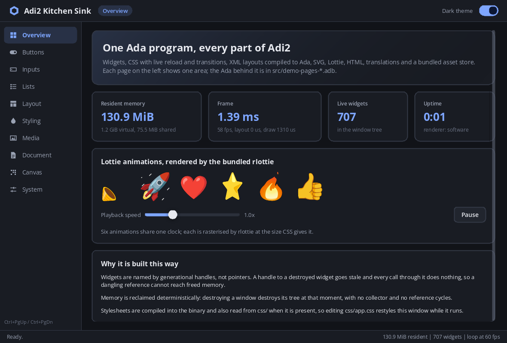

### Buttons

Button variants, toggle buttons, switches and an option group.

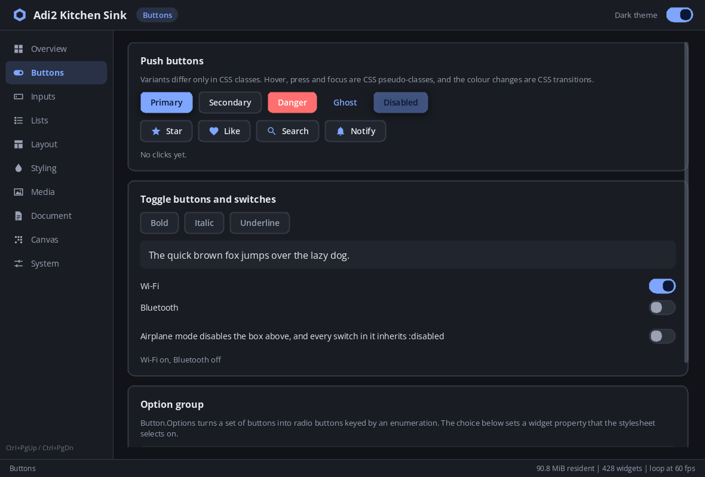

### Inputs

Text fields, paired sliders and value inputs, combo boxes, the text editor and a custom widget.

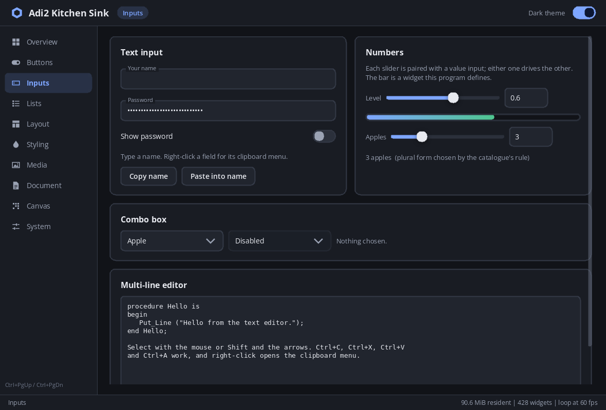

### Lists

A list box built from data, coloured by a widget property.

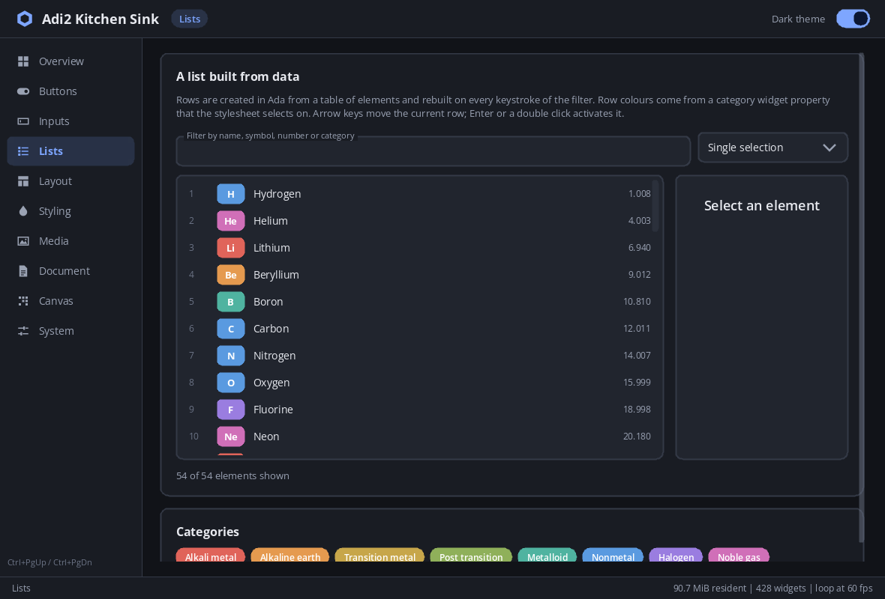

### Layout

Flex, grid, positioning and overflow, from CSS alone.

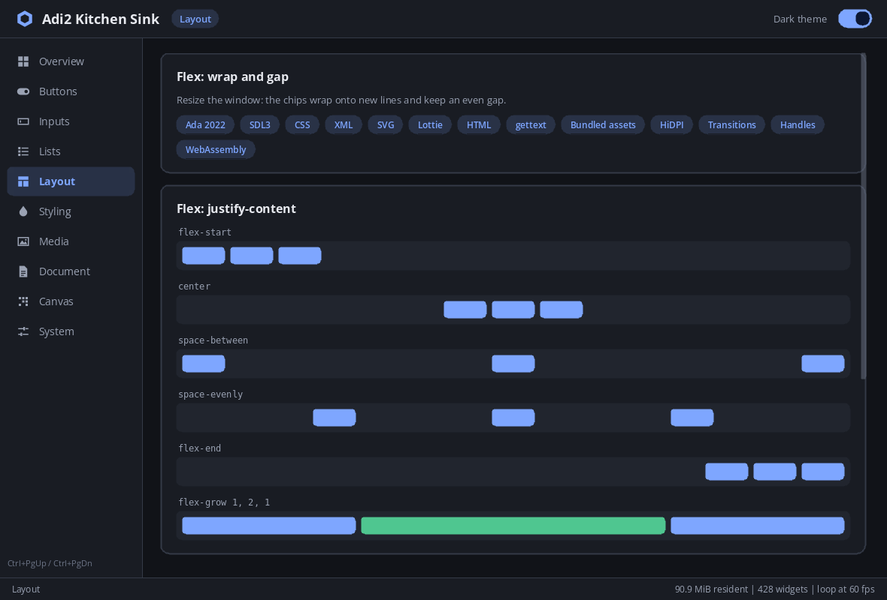

### Styling

Transitions, gradients, borders, shadows and widget properties.

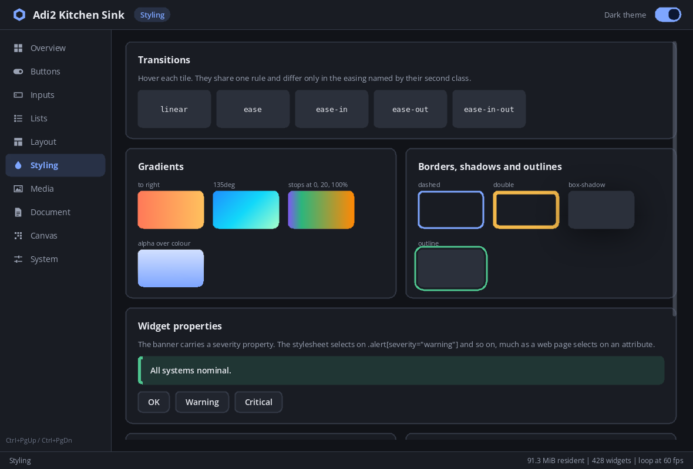

### Media

SVG with `object-fit`, raster crops, tinted sprites and a GIF.

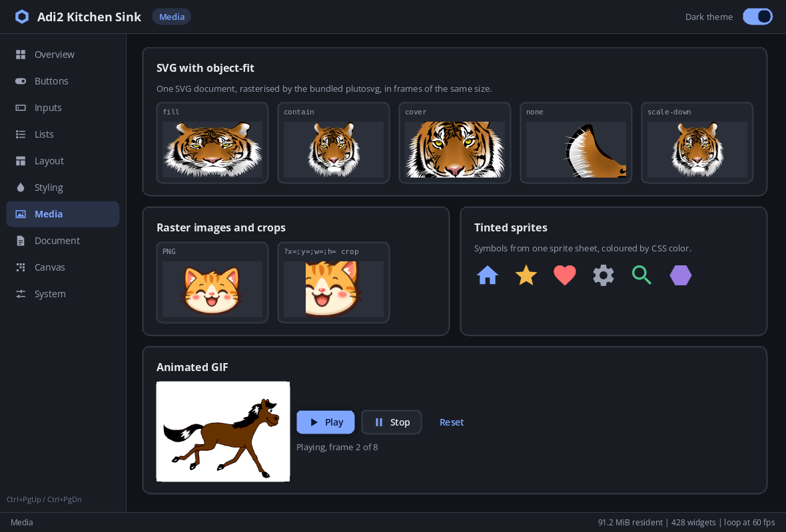

### Document

The HTML view.

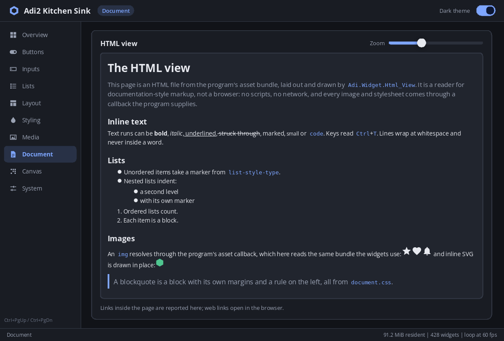

### Canvas

Conway's Game of Life drawn through a texture view.

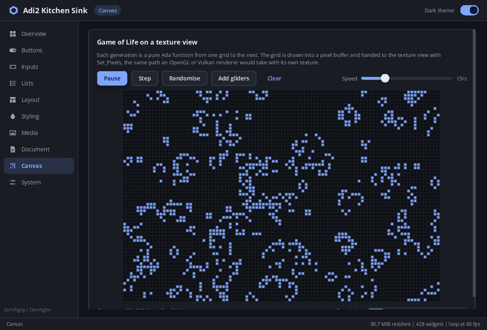

### System

Dialogs, a context menu, file dialogs and preferences.

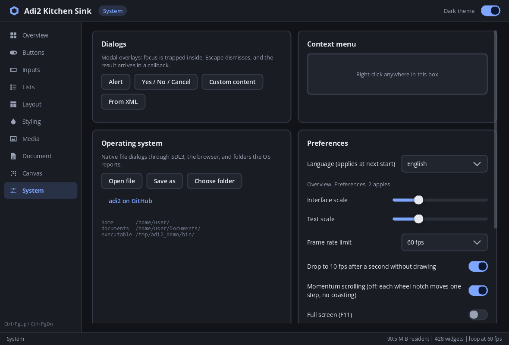

### Light theme

The same window after switching the palette.

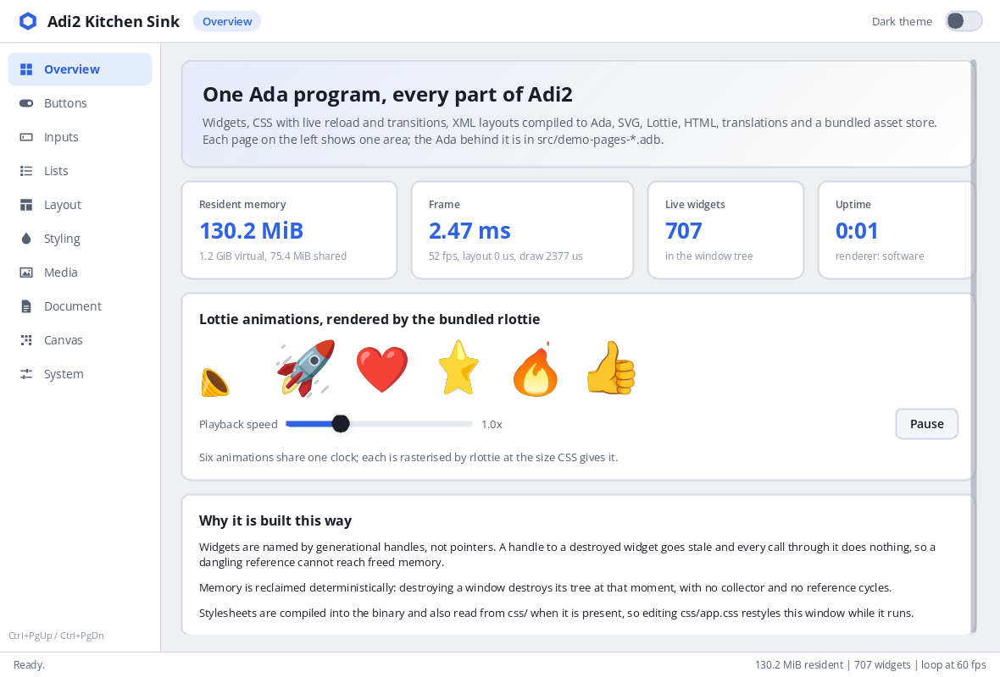

## Build and run

A release build runs in Docker, with the toolchain pinned in the `Dockerfile`:

```sh
./manage.sh build          # writes dist/adi2_demo-<version>-linux-x86_64.tar.gz
```

The tarball holds `bin/adi2_demo`, the Lottie files and font faces it reads from
`share/adi2_demo/`, and the licence texts. `dist/` also receives a `.sha256`
file with the tarball's checksum, which `sha256sum -c` verifies. It runs on
x86-64 Linux with glibc 2.38 or later and SDL3 3.2 or later, including SDL3_ttf
and SDL3_image.

A local build needs SDL3, SDL3_ttf, SDL3_image, Python 3 and Alire. Alire
fetches GNAT and gprbuild.

```sh
alr build                  # regenerates src/generated/, then compiles
./bin/adi2_demo            # options below
alr test                   # unit and property tests of the pure packages
```

| Option              | Effect                                                                                          |
| ------------------- | ----------------------------------------------------------------------------------------------- |
| `--lang en\|fr\|de` | Language for this run; otherwise the saved preference                                           |
| `--fps N`           | Frame-rate limit for this run; otherwise the saved preference (60, 30 or 20 on the System page) |
| `--page NAME`       | Open on a page, e.g. `--page canvas`                                                            |
| `--stats`           | Print, once a second, frames drawn and average layout, draw and present time                    |

`alr build` runs `tools/generate.sh` first, as a pre-build action. It turns
`css/`, `ui/`, `i18n/` and `assets/` into Ada under `src/generated/`, and copies
the third-party assets listed under "Licences" out of the pinned adi2 crate.
adi2 is not in the Alire index, so `alire.toml` pins a commit.

Shortcuts: Ctrl+PgUp and Ctrl+PgDn change page, Ctrl+T switches theme, F11
toggles full screen.

## Pages

| Page     | Shows                                                                                                                                                                                                                | Ada                                      |
| -------- | -------------------------------------------------------------------------------------------------------------------------------------------------------------------------------------------------------------------- | ---------------------------------------- |
| Overview | Resident memory, frame time, live widget count; six Lottie animations with shared speed control                                                                                                                      | `demo-pages-overview.adb`                |
| Buttons  | Button variants, icon buttons from an SVG sprite, toggle buttons, switches, a disabled container whose children inherit `:disabled`, an option group                                                                 | `demo-pages-buttons.adb`                 |
| Inputs   | Text and password inputs, clipboard, float and integer sliders paired with value inputs, plural forms, combo boxes, the multi-line editor, a custom widget                                                           | `demo-pages-inputs.adb`                  |
| Lists    | A list box whose rows are built in Ada from `Demo.Elements` and rebuilt per keystroke; selection modes; rows coloured by a `category` widget property                                                                | `demo-pages-lists.adb`                   |
| Layout   | Flex wrap and `justify-content`, grid spans, absolute positioning, overflow scrolling                                                                                                                                | XML and CSS only                         |
| Styling  | Transition easings, gradients, borders, shadows, outlines, a `severity` property selected by `.alert[severity="critical"]`, a style composed in Ada                                                                  | `demo-pages-styling.adb`                 |
| Media    | `object-fit` on SVG, raster crop by URL query, tinted sprites, an icon from SVG path data, GIF playback                                                                                                              | `demo-pages-media.adb`                   |
| Document | The HTML view: lists, inline SVG, images and stylesheets through callbacks, link handling, zoom                                                                                                                      | `demo-pages-document.adb`                |
| Canvas   | Conway's Game of Life stepped by a pure function and uploaded with `Texture_View.Set_Pixels`                                                                                                                         | `demo-pages-canvas.adb`, `demo-life.adb` |
| System   | Alert, confirm and custom-content dialogs, a dialog declared in XML, a context menu, native file dialogs, OS folders, persisted preferences, UI and text scale, frame-rate limit, momentum scrolling, debug overlays | `demo-pages-system.adb`                  |

## How it fits together

- **Layouts.** `ui/shell.xml` declares the window; each page is a separate file
  included with `<component>`. `xml_to_ada.py` compiles each file to a package
  with a generic `Instance`. `src/demo-ui.ads` instantiates the shell at library
  level, so the page packages can name its widgets and assign its callbacks with
  `'Access`.
- **Page packages.** Each `Demo.Pages.*` package has `Wire`, which sets
  callbacks before `Demo.UI.Build`, and `Start`, which runs after it.
  `src/adi2_demo.adb` calls them in that order.
- **Custom widget.** `Demo.Meter` derives from `Box_Widget`, registers through
  `Adi.Widget.Extension`, and draws three CSS parts. `ui/widgets_extra.xml` adds
  it to the XML grammar as `<meter>`.
- **Styles and themes.** `css/app.css` names colours only through `var()`;
  `css/palette_dark.css` and `css/palette_light.css` define them. A theme is a
  palette installed ahead of `app.css`. `Demo.Theme` installs it into every
  generated package's style source and into its own source, which styles widgets
  built in Ada. The sheets are read from `css/` when it sits beside `bin/`, so
  saving an edit restyles the running window. Otherwise the copies in the asset
  bundle are used.
- **Popups.** Combo dropdowns and context menus copy their style when they are
  built, so no live sheet reaches them. `css/overlays.css` is compiled once per
  palette, and `Demo.Theme` hands each tracked popup the matching set on every
  theme change.
- **Assets.** Images, SVG, HTML, CSS and the regular font are compiled into the
  binary (`Demo_Bundle`, `Bundle_Mode`). Lottie files and the bold and italic
  font faces stay in `share/adi2_demo/`, because adi2 opens those by path only.
- **Frame rate.** adi2's loop wakes at a fixed rate whether or not anything
  changed. `Demo.Pacing` owns the application object and runs it at the limit
  while the window draws, then drops to 10 fps after a second without drawing
  (`Demo.Frame_Policy`). The program's own periodic readouts are marked so they
  do not count as activity.
- **Animation widgets.** `Demo.Lottie_View` and `Demo.Gif_View` derive from
  adi2's Lottie and animated-image widgets and override `On_Tick` so that a new
  frame marks the widget for redrawing only. See "Things found while building
  this".
- **Pure core.** `Demo.Life`, `Demo.Elements`, `Demo.Text`, `Demo.Colours`,
  `Demo.Proc_Stats` and `Demo.Frame_Policy` have no GUI dependency.
  `src/demo_tests.adb` tests them, including property tests: Life commutes with
  translation on the torus, and every element matches its own name, symbol and
  number.

## Inspecting it while it runs

adi2 has a development-only bridge for screenshots, the widget tree, resolved
CSS and simulated input. Dependencies build in their release profile, which
links a stub, so build adi2 in development first:

```sh
alr build --profiles=adi2=development
./bin/adi2_demo &
python3 alire/cache/pins/adi2_*/tools/adi_mcp_server.py --cli screenshot
python3 alire/cache/pins/adi2_*/tools/adi_mcp_server.py --cli perf_stats
```

`SDL_VIDEO_DRIVER=offscreen SDL_RENDER_DRIVER=software` runs it without a
visible window. Screenshots came back blank with the offscreen driver's default
renderer; the software renderer gives complete ones.

## Measurements

Taken on Linux (Arch) with SDL's offscreen driver and software renderer, adi2 at
commit `5caa4e8`. A GPU renderer changes the drawing figures.

|                                  |                                                                                                                                                          |
| -------------------------------- | -------------------------------------------------------------------------------------------------------------------------------------------------------- |
| Stripped binary                  | 16.2 MiB, of which 638 KiB are bundled assets                                                                                                            |
| Resident memory, all pages built | ~135–150 MiB RSS, of which ~66 MiB is private; the rest is shared libraries (SDL loads Mesa's `libgallium` and `libLLVM` even for the software renderer) |
| Texture cache                    | ~10 MiB, mostly rasterised text                                                                                                                          |
| Widgets                          | 698 in the tree with all ten pages built                                                                                                                 |
| CPU on a static page             | 4.2% at a fixed 60 fps; 2.3% with the idle drop to 10 fps                                                                                                |
| Layout per Lottie frame          | 10.3 ms with adi2's widget; 0.24 ms with `Demo.Lottie_View`                                                                                              |
| CPU with Lottie playing          | 100% at 60 fps, 74% at 20 fps: SDL's software renderer spends ~22 ms presenting each frame, which a GPU renderer does not                                |

## Things found while building this

- **Animation frames relay out the window.** `Adi.Widget.RLottie`,
  `Adi.Widget.Animated_Image` and `Adi.Widget.Texture_View.Set_Pixels` call
  `Mark_Dirty` for each new frame. That marks layout dirty and bumps the content
  version of every ancestor, so the next frame re-measures the text of the whole
  visible page: 97% of the frame's layout work for something that never changes
  size. `Mark_Render_Dirty` is enough, since the widget's draw items are rebuilt
  without a layout. The demo's `Lottie_View` and `Gif_View` do that.
  `Set_Pixels` cannot be overridden, so the Canvas page still lays out once per
  generation. The demo also pauses animations while their page is hidden.
- **No idle wait.** The loop sleeps to the next frame rather than waiting for an
  event, so an idle window costs its frame rate in wake-ups.
- **Release builds do not log.** `Adi.Log` writes nothing, errors included,
  unless adi2 is built in its development profile. `--stats` writes to standard
  output for that reason.
- **Scrollbars overlay content.** A scroll container draws its bar inside its
  content box without reserving a gutter, so `app.css` styles it as a
  translucent overlay.
- **SIGTERM is a close request.** SDL turns SIGTERM into a quit event, which
  goes through `Connect_Close_Request`. With "Ask before quitting" on, the
  program answers SIGTERM with the quit dialog and keeps running.
- **Selectors are flat.** There are no descendant or child combinators: each
  widget that looks different carries its own class.
- **Generated code warns.** `css_to_ada.py` and `xml_to_ada.py` output compiles
  with unused-`with` warnings under Alire's default `-gnatwa`.

## Licences

adi2_demo is under the Apache License 2.0, the licence of adi2 itself; see
`LICENSE`.

### Third-party material

`tools/generate.sh` copies these files out of the pinned adi2 crate at build
time. None of them is stored in this repository; they land in `build/assets/`
(compiled into the binary) and `share/adi2_demo/` (read beside it). Terms as
recorded in adi2's `examples/assets/NOTICE.md` and `REUSE.toml`:

| File             | Source                                                                                 | Licence                                                     |
| ---------------- | -------------------------------------------------------------------------------------- | ----------------------------------------------------------- |
| `icons.svg`      | Google Material Icons, path data verbatim                                              | Apache-2.0                                                  |
| `tiger.svg`      | "Tiger Face" by microugly, openclipart.org, ear clip paths baked into geometry by adi2 | Public domain (CC-PDDC)                                     |
| `animhorse.gif`  | By Janke, 2005, Wikimedia Commons, unmodified                                          | CC BY-SA 2.5                                                |
| `happycat.png`   | adi2 repository                                                                        | Apache-2.0                                                  |
| `OpenSans-*.ttf` | Open Sans, via adi2's `vendor/open-sans/`                                              | SIL Open Font License 1.1 (`share/adi2_demo/fonts/OFL.txt`) |
| `noto_*.json`    | Animated Noto Emoji, Google LLC, unmodified                                            | CC BY 4.0                                                   |

Animated Noto Emoji: <https://googlefonts.github.io/noto-emoji-animation/>. CC
BY 4.0 requires this attribution to travel with the files.

Everything else — `assets/glyphs.svg`, `assets/document.html`,
`assets/document.css`, the stylesheets, layouts, translations and Ada sources —
is original to this repository.

adi2 is Apache-2.0 and links vendored MIT, FTL, MPL-2.0 and BSD-3-Clause code
into the binary; see its `README.md` and `REUSE.toml`. Release tarballs carry
those licence texts in `licenses/adi2/`.

### Binary distributions

Portions of this software are copyright © The FreeType Project
(<https://freetype.org>). All rights reserved. This software is based in part on
the work of the FreeType Team.

The binary contains `vendor/rlottie/src/vector/vinterpolator.cpp` from adi2,
which is under the Mozilla Public License 2.0. Its source form is at
<https://github.com/ovenpasta/adi2/blob/5caa4e817733c16ab3f589ae724142e0f7f65b38/vendor/rlottie/src/vector/vinterpolator.cpp>.
